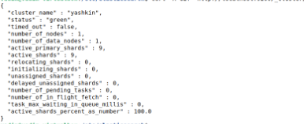
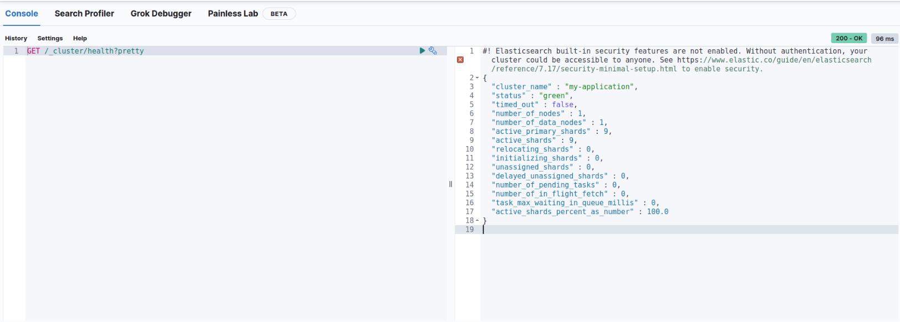
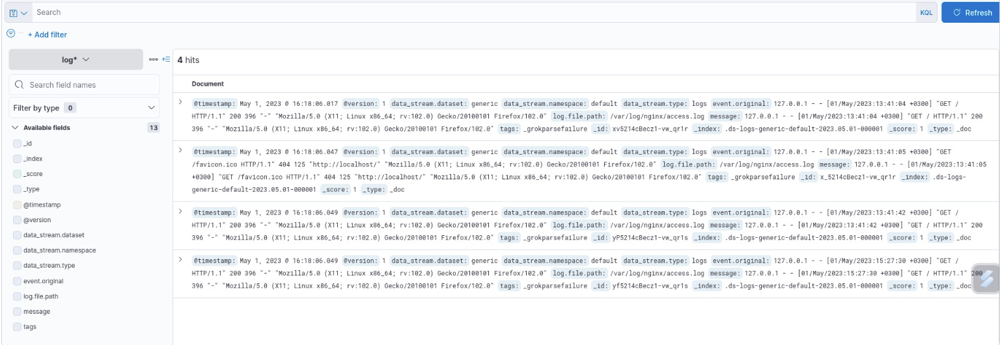
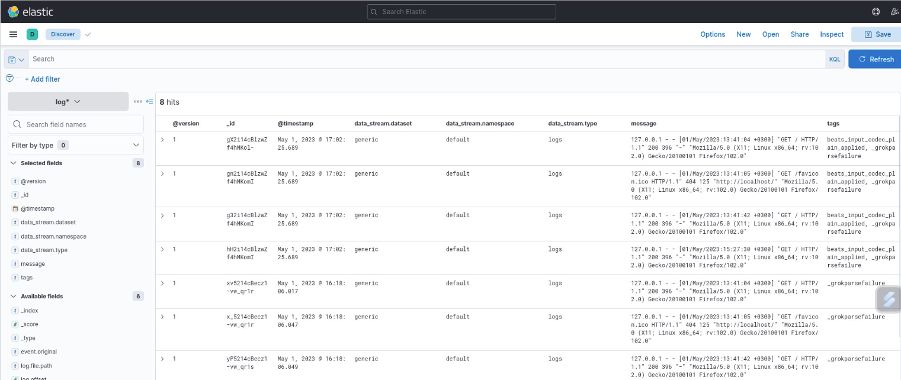

# Домашнее задание к занятию "ELK" - `Мильдзихов Сергей`

   
---

### Задание 1.

Установите и запустите Elasticsearch, после чего поменяйте параметр cluster_name на случайный.

Приведите скриншот команды 'curl -X GET 'localhost:9200/_cluster/health?pretty'

### Ответ
Доступ к репозиториям Elastic с IP адресов России заблокирован. Для установки нужно настраивать прокси или vpn на сервере, либо вручную скачивать пакеты.

### Задание 2. 

Установите и запустите Kibana.

### Ответ

### Задание 3

Установите и запустите Logstash и Nginx. С помощью Logstash отправьте access-лог Nginx в Elasticsearch.

### Ответ

### Задание 4

Установите и запустите Filebeat. Переключите поставку логов Nginx с Logstash на Filebeat.

### Ответ

